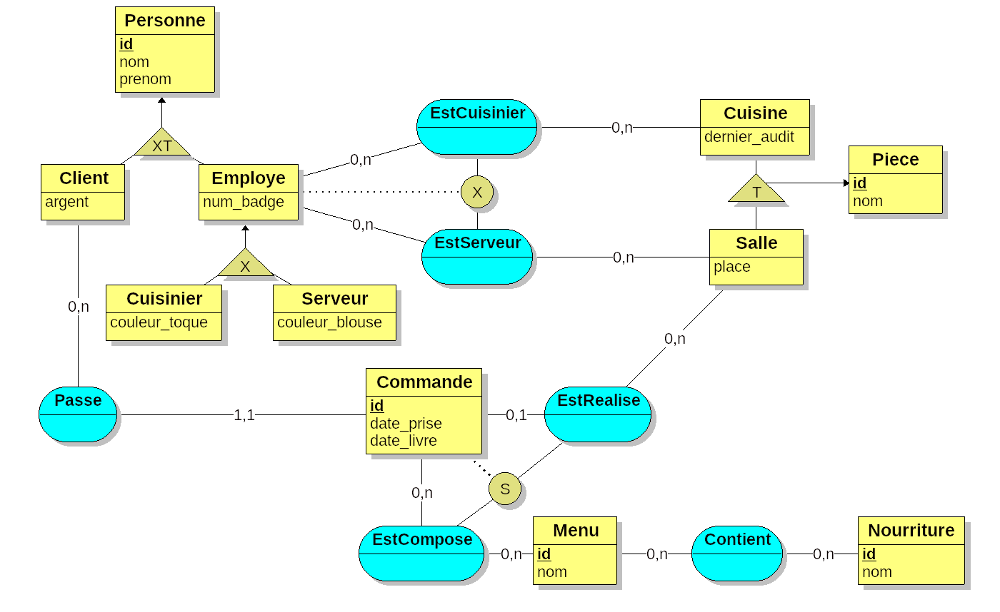
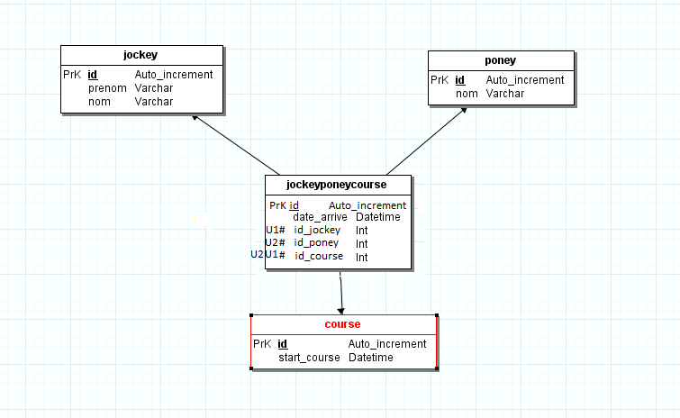
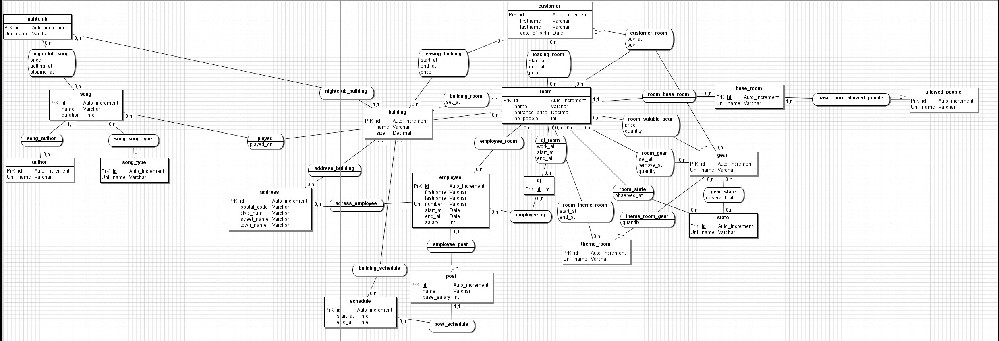

# MyDigitalSchool - TPs SQL

## Restaurant

TP n°1 du 19/11/2019

<kbd></kbd>

* **Restaurant.png** - Schéma MCD
* **Restaurant.loo** - Schéma MCD (Projet [Looping](https://www.looping-mcd.fr/))
* **restaurant.sql** - Base de données
* **fixture.sql** - Script SQL (Génère la base de données)

## JockeyPoney

TP n°2 du 28/01/2020

<kbd></kbd>

* **JockeyPoney.png** - Schéma MCD
* **jockeyponey.sql** - Base de données
* **jockeyponey1.sql** - Base de données (Utilisée pour les requêtes)
* **fixture.sql** - Script SQL (Génère la base de données)
* **query.sql** - Requêtes SQL (Requêtes diverses)

## NightClub

TP n°3 du 28/01/2020

<kbd></kbd>

* **NightClub.png** - Schéma MCD
* **NightClubTables.sql** - Tables de la BDD (CREATE)
* **NightClubFixtures.sql** - Données de la BDD (INSERT)
* **NightClubRequests.sql** - Requètes SQL (SELECT)
