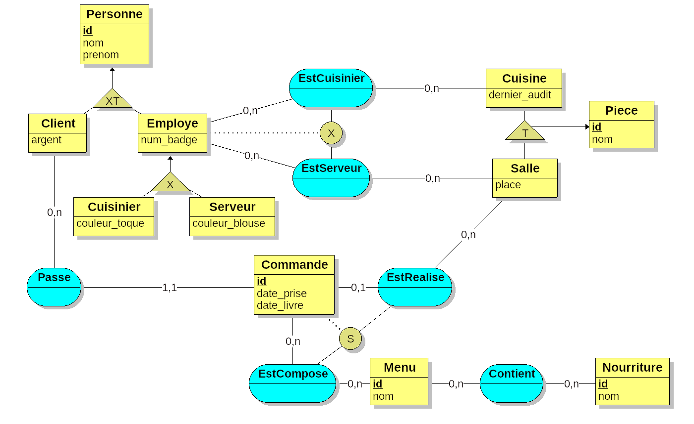

# MyDigitalSchool - TP SQL

## Restaurant

TP du 19/11/2019

<kbd></kbd>

### Architecture ###

* **Restaurant.png** - Schéma MCD
* **Restaurant.loo** - Schéma MCD (Projet [Looping](https://www.looping-mcd.fr/))
* **restaurant.sql** - Base de données
* **fixture.sql** - Script SQL (Génère la base de données)
